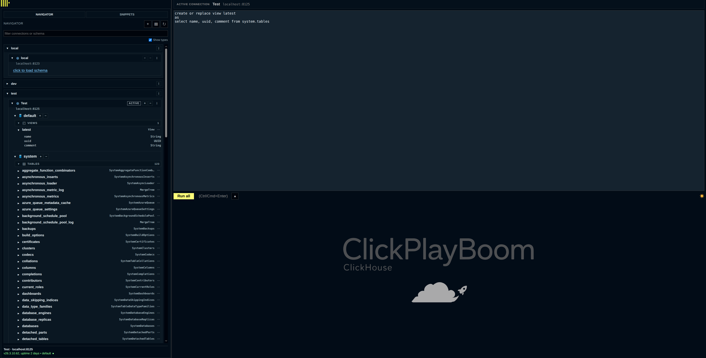

# click-play-boom

`click-play-boom` is a single-file ClickHouse HTTP query interface.



A rework of the ClickHouse Play page that keeps the same lightweight shape:

- one self-contained HTML file
- no build step, no framework
- no external resources loaded on startup.

The rework focuses on making the browser UI useful for real query work rather than only one-off single-statement experiments.


## What It Does

- Runs ClickHouse queries over the HTTP interface.
- Executes all statements in the editor, or only the currently selected text.
- Splits multi-statement scripts using the embedded ClickHouse lexer when WebAssembly is available.
- Shows each executed statement in its own result tab.
- Keeps an action history for executed statements and their status.
- Manages multiple saved connections in browser local storage.
- Shows the active connection clearly above the editor.
- Loads schemas through a navigator with databases, tables, views, materialized views, and columns.
- Provides table actions to generate common SQL:
  - `SELECT *`
  - `SELECT` with all column names
  - `SELECT count(*)`
  - `SHOW TABLE`
  - `system.tables` lookup
  - `system.query_log` lookup
  - `INSERT` template
  - `DROP TABLE` / `DROP VIEW`
- Stores query snippets in local folders.
- Supports result downloads in ClickHouse formats such as CSV, TSV, JSON, JSONLines, Parquet, Markdown, or a custom format.
- Can optionally write preview results to ClickHouse query cache so a later download can reuse the same result.
- Supports compact editor mode, resizable sidebar, and light/dark themes.

## Files

- [`click-play-boom.html`](./click-play-boom.html) is the app.

There is intentionally no package manifest, build pipeline, or generated asset directory.

## Usage

Open [`click-play-boom.html`](./click-play-boom.html) in a browser.

By default, when opened from the filesystem, it targets:

```text
http://localhost:8123/
```

When served over HTTP, it defaults to the same origin that served the page. You can also pass connection details in the URL:

```text
click-play-boom.html?url=http%3A%2F%2Flocalhost%3A8123%2F&user=default
```

The app sends queries with `add_http_cors_header=1`, so the target ClickHouse server must be reachable from the browser and allow the browser request to complete.

## Running Queries

Use the editor as a SQL script buffer.

- Press `Ctrl+Enter` or `Cmd+Enter` to run.
- If text is selected, only the selected text is executed.
- If nothing is selected, all statements in the editor are executed.
- Each statement is run sequentially and receives its own result tab.
- Press the run button while a query is active to stop after the current request is cancelled.

The current implementation uses ClickHouse lexer tokenization for statement splitting when the browser supports WebAssembly. If WebAssembly is unavailable, it falls back to simple semicolon splitting.

## Navigator

The left navigator stores connections locally and lazy-loads schema information from ClickHouse system tables.

- Select a connection to make it active and load databases.
- Expand databases to load tables and views.
- Expand tables to load columns.
- Use the filter box to search connections and loaded schema.
- Use table context menus to generate SQL into the editor.
- Use the connection context menu to edit/delete a connection or open the ClickHouse dashboard for that server.

Connection details are stored in browser local storage, including passwords. Treat this as a local development convenience, not a secure secret store.

## Snippets

The snippets tab stores reusable queries in browser local storage.

- Create folders.
- Save the current editor contents.
- Load snippets back into the editor.
- Rename, update, or delete snippets through their context menus.

## Downloads

After a successful query, use the download control to rerun the active result query with a download-oriented output format.

Supported presets are:

- `CSV`
- `TSV`
- `JSON`
- `JSONLines`
- `Parquet`
- `Markdown`

You can also enter any ClickHouse format name manually.

When "Reuse cached result for download" is enabled, preview queries are written to ClickHouse query cache and downloads are requested with query-cache reads enabled. This is useful for large or expensive results, but it depends on server support and query-cache settings.

## Browser State

The app stores preferences and local data in `localStorage`, including:

- saved connections
- active connection
- navigator expansion state
- sidebar width/collapsed state
- active sidebar tab
- query snippets
- compact editor preference
- download cache preference
- theme preference


## Development

The project follows the original ClickHouse Play constraint of being a standalone HTML document:

- CSS is embedded in the page.
- JavaScript is embedded in the page.
- No npm install is required.
- No bundler is required.
- No external scripts, fonts, or images are loaded during startup.

This keeps deployment simple: replace or serve the HTML file wherever you want the query UI to live.

## Lineage

A fork of https://github.com/ClickHouse/ClickHouse/blob/v26.3.3.20-lts/programs/server/play.html

## Status

The app is usable as a local/development ClickHouse HTTP query UI. Known rough edges from the current implementation include:

- long query text can still take up too much vertical space in result summaries
- very wide result tables can make horizontal scrolling awkward
- result copy-to-clipboard options are still pending
- session/server settings management is still future work
- saved/admin query panels are still future work

